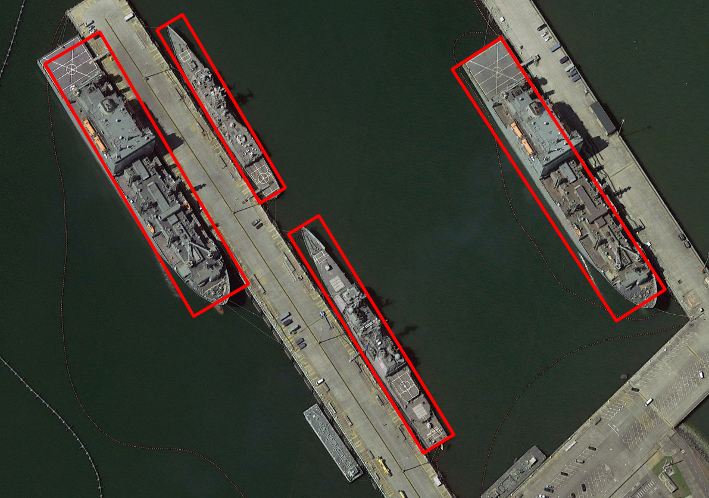

<!-- <a href="https://apps.apple.com/app/id1452689527" target="_blank">
</a>
&nbsp

 -->


The goal of the work described in this paper is to achieve a rotated bounding box detection of directional objects for remote-sensing images. Specifically, a separate information dimension about the object angle is introduced, along with the corresponding loss and regression functions. This method can well indicate the direction of the object to be detected. By determining the angle, the proposed bounding box shape has a more accurate width and height to fit the actual target, which is of great significance not only in intuitive visual experience, but also in the re-application of the result data. At the same time, most of the current remote-sensing datasets are labeled with four points (x1 y1, x2 y2, x3 y3, x4 y4) or the width and height of the object are not clearly defined. Therefore in order to obtain the desired effect after training, the data are reprocessed before training to calculate the true width and height of the object and the deflection angle relative to the coordinate axis. To sum up, the main contributions of this study are as follows.


## Model Checkpoints
DOTA Dataset
| Model | PL | BD | BR | GTF | SV | LV | SH | TC | BC | ST | SBF | RA | HA | SP | HC | mAP |
|---------- |------ |------ |------ |------ |------|------ |------|------ |------| ------| ------|------|------|------|------| :------: |
| [YOLOv5s](https://github.com/ultralytics/yolov5/releases/tag/v3.0)    | 66.5 | 52.7 | 13.1 | 27.0 | 45.7 | 68.8 | 41.0 | 88.5 | 40.5 | 22.6 | 28.2 | 21.1 | 51.5 | 41.6 | 25.0 | 42.2 

HRSC2016
| Model | Backbone | Size> | mAP50 | 
|---------- |------ |------ | :------: |
| [YOLOv5s](https://github.com/ultralytics/yolov5/releases/tag/v3.0)    | DarkNet53     | 800 × 800    | 96.2  


## Requirements

Python 3.8 or later with all [requirements.txt](https://github.com/ultralytics/yolov5/blob/master/requirements.txt) dependencies installed, including `torch>=1.6`. To install run:
```bash
$ pip install -r requirements.txt
```


## Tutorials

* [Train Custom Data](https://github.com/ultralytics/yolov5/wiki/Train-Custom-Data)
* [Multi-GPU Training](https://github.com/ultralytics/yolov5/issues/475)
* [PyTorch Hub](https://github.com/ultralytics/yolov5/issues/36)
* [ONNX and TorchScript Export](https://github.com/ultralytics/yolov5/issues/251)
* [Test-Time Augmentation (TTA)](https://github.com/ultralytics/yolov5/issues/303)
* [Model Ensembling](https://github.com/ultralytics/yolov5/issues/318)
* [Model Pruning/Sparsity](https://github.com/ultralytics/yolov5/issues/304)
* [Hyperparameter Evolution](https://github.com/ultralytics/yolov5/issues/607)
* [TensorRT Deployment](https://github.com/wang-xinyu/tensorrtx)


## Environments

YOLOv5 may be run in any of the following up-to-date verified environments (with all dependencies including [CUDA](https://developer.nvidia.com/cuda)/[CUDNN](https://developer.nvidia.com/cudnn), [Python](https://www.python.org/) and [PyTorch](https://pytorch.org/) preinstalled):

- **Google Colab Notebook** with free GPU: <a href="https://colab.research.google.com/github/ultralytics/yolov5/blob/master/tutorial.ipynb"></a>
- **Kaggle Notebook** with free GPU: [https://www.kaggle.com/ultralytics/yolov5](https://www.kaggle.com/ultralytics/yolov5)
- **Google Cloud** Deep Learning VM. See [GCP Quickstart Guide](https://github.com/ultralytics/yolov5/wiki/GCP-Quickstart) 
- **Docker Image** https://hub.docker.com/r/ultralytics/yolov5. See [Docker Quickstart Guide](https://github.com/ultralytics/yolov5/wiki/Docker-Quickstart) 


## Inference

Inference can be run on most common media formats. Model [checkpoints](https://drive.google.com/open?id=1Drs_Aiu7xx6S-ix95f9kNsA6ueKRpN2J) are downloaded automatically if available. Results are saved to `./inference/output`.
```bash
$ python detect.py --source 0  # webcam
                            file.jpg  # image 
                            file.mp4  # video
                            path/  # directory
                            path/*.jpg  # glob
                            rtsp://170.93.143.139/rtplive/470011e600ef003a004ee33696235daa  # rtsp stream
                            rtmp://192.168.1.105/live/test  # rtmp stream
                            http://112.50.243.8/PLTV/88888888/224/3221225900/1.m3u8  # http stream
```

To run inference on examples in the `./inference/images` folder:

```bash
$ python detect.py --source ./inference/images/ --weights yolov5s.pt --conf 0.4

Namespace(agnostic_nms=False, augment=False, classes=None, conf_thres=0.4, device='', fourcc='mp4v', half=False, img_size=640, iou_thres=0.5, output='inference/output', save_txt=False, source='./inference/images/', view_img=False, weights='yolov5s.pt')
Using CUDA device0 _CudaDeviceProperties(name='Tesla P100-PCIE-16GB', total_memory=16280MB)

Downloading https://drive.google.com/uc?export=download&id=1R5T6rIyy3lLwgFXNms8whc-387H0tMQO as yolov5s.pt... Done (2.6s)

image 1/2 inference/images/bus.jpg: 640x512 3 persons, 1 buss, Done. (0.009s)
image 2/2 inference/images/zidane.jpg: 384x640 2 persons, 2 ties, Done. (0.009s)
Results saved to /content/yolov5/inference/output
```

  


## Training

Download [COCO](https://github.com/ultralytics/yolov5/blob/master/data/scripts/get_coco.sh) and run command below. Training times for YOLOv5s/m/l/x are 2/4/6/8 days on a single V100 (multi-GPU times faster). Use the largest `--batch-size` your GPU allows (batch sizes shown for 16 GB devices).
```bash
$ python train.py --data coco.yaml --cfg yolov5s.yaml --weights '' --batch-size 64
                                         yolov5m                                40
                                         yolov5l                                24
                                         yolov5x                                16
```


## Citation

[](https://zenodo.org/badge/latestdoi/264818686)


## About Us

Ultralytics is a U.S.-based particle physics and AI startup with over 6 years of expertise supporting government, academic and business clients. We offer a wide range of vision AI services, spanning from simple expert advice up to delivery of fully customized, end-to-end production solutions, including:
- **Cloud-based AI** systems operating on **hundreds of HD video streams in realtime.**
- **Edge AI** integrated into custom iOS and Android apps for realtime **30 FPS video inference.**
- **Custom data training**, hyperparameter evolution, and model exportation to any destination.

For business inquiries and professional support requests please visit us at https://www.ultralytics.com. 


## Contact

**Issues should be raised directly in the repository.** For business inquiries or professional support requests please visit https://www.ultralytics.com or email Glenn Jocher at glenn.jocher@ultralytics.com. 
